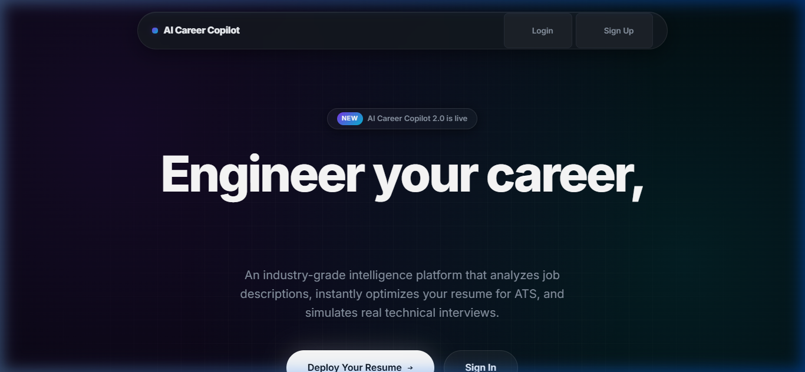

# AI Career Copilot

An AI-powered career assistant that analyzes your resume, scores it against ATS systems, matches it to job descriptions, generates a personalized learning roadmap, recommends portfolio projects, and conducts a full mock interview with voice support.

## ✨ Features

| Feature | Description |
|---|---|
| 📄 Resume Analyzer | Upload PDF/DOCX or paste text — AI extracts skills and gaps |
| 🎯 ATS Scoring | Scores your resume 0–100 for ATS compatibility |
| 🔗 Job Description Matching | Paste a JD or a URL — auto-scraped and matched against your resume |
| 🗺️ Learning Roadmap | Ordered steps to close your skill gaps |
| 💼 Project Recommendations | 3–4 portfolio project ideas with tech stack and difficulty |
| 🎤 Voice Interview | AI interviewer asks questions, you answer via mic, Whisper transcribes |
| 🤖 AI Interview Room | Camera + voice interview with real-time evaluation and a full report |
| 📊 Progress Tracking | Interview history and performance trends over time |
| 🔐 Auth System | Secure signup/login with hashed passwords and CSRF protection |

## 🖥️ Screenshots

**Homepage**


## 🛠️ Tech Stack

**Backend**
* Python 3.10+
* Flask 3.0
* SQLAlchemy ORM
* Flask-WTF (CSRF protection)
* Werkzeug (password hashing)

**Database**
* MySQL 8.0

**AI**
* OpenAI-compatible API (NVIDIA NIM / GPT-4o-mini)
* OpenAI Whisper (speech-to-text)
* Browser SpeechSynthesis API (text-to-speech, free)

**File Parsing**
* PyPDF2 (PDF)
* python-docx (DOCX)

**Web Scraping**
* Requests + BeautifulSoup4 (job URL scanner)

**Frontend**
* Jinja2 templates
* Vanilla JS (MediaRecorder API, getUserMedia)
* Custom CSS (dark theme, multi-color palette)

## 🚀 Setup & Installation

**1. Clone the repository**
```bash
git clone https://github.com/YOUR_USERNAME/ai-career-copilot.git
cd ai-career-copilot
```

**2. Create a virtual environment**
```bash
python -m venv venv

# Windows
venv\Scripts\activate

# macOS / Linux
source venv/bin/activate
```

**3. Install dependencies**
```bash
pip install -r requirements.txt
```

**4. Create the MySQL database**
```sql
CREATE DATABASE career_copilot;
```

**5. Set up environment variables**
```bash
cp .env.example .env
```
Open `.env` and fill in your values:
```
SECRET_KEY=your-flask-secret-key
NVIDIA_API_KEY=your-nvidia-api-key
DB_USER=root
DB_PASSWORD=your-mysql-password
DB_HOST=localhost
DB_PORT=3306
DB_NAME=career_copilot
```

**6. Run the app**
```bash
python app.py
```
Open http://127.0.0.1:5000 in your browser.

## 📁 Project Structure

```text
ai-career-copilot/
├── app.py                  # All Flask routes
├── ai.py                   # AI prompt functions (resume + interview)
├── scraper.py              # Job URL scraper (BeautifulSoup)
├── db.py                   # MySQL connection (SQLAlchemy)
├── models.py               # Database models
├── requirements.txt        # Python dependencies
├── .env.example            # Environment variable template
├── .gitignore
├── static/
│   └── style.css           # Dark multi-color theme
├── templates/
│   ├── base.html           # Base layout + nav
│   ├── login.html
│   ├── signup.html
│   ├── dashboard.html      # Resume analyzer + results
│   ├── interview.html      # Voice interview room
│   └── history.html        # Past analyses
└── screenshots/
    ├── dashboard.png
    └── interview.png
```

## 🔌 API Endpoints

| Method | Route | Description |
|---|---|---|
| GET/POST | `/` | Redirect to dashboard or login |
| GET/POST | `/signup` | User registration |
| GET/POST | `/login` | User login |
| GET | `/logout` | Clear session |
| GET/POST | `/dashboard` | Resume analysis |
| GET | `/history` | Past analyses |
| GET/POST | `/interview` | Voice interview session |
| POST | `/interview/evaluate` | Evaluate single answer (JSON) |
| POST | `/interview/transcribe` | Whisper speech-to-text (JSON) |

## 🧠 AI Prompt Design

The resume analyzer returns structured JSON with:
* `skills` — relevant skills found
* `missing_skills` — gaps for the target role
* `ats_score` — 0–100 ATS compatibility
* `resume_mistakes` — specific formatting/content issues
* `improvement_suggestions` — actionable fixes
* `roadmap` — ordered learning steps
* `interview_questions` — role-specific questions
* `project_recommendations` — portfolio ideas with tech stack
* `jd_match` — keyword overlap with job description (if provided)

## 🔒 Security
* Passwords hashed with `werkzeug.security` (PBKDF2 + SHA256)
* CSRF protection on all forms via Flask-WTF
* API keys stored in `.env`, never hardcoded
* SSRF protection in the job URL scraper (blocks internal IPs)
* `.env` excluded from Git via `.gitignore`

## 🗺️ Roadmap
- [x] Resume analyzer with ATS scoring
- [x] Job description matching + URL scanner
- [x] Project recommendations
- [x] Voice interview with Whisper
- [x] AI Interview Room (camera + full report)
- [ ] Cover letter generator
- [ ] Multi-resume comparison
- [ ] Export report as PDF
- [ ] Deploy to Railway / Render

## 📄 License
MIT License — free to use, modify, and distribute.

## 👤 Author
Built by **Naveen Gupta**

GitHub: [@Naveengupta2006](https://github.com/Naveengupta2006)
LinkedIn: [https://www.linkedin.com/in/naveen-gupta-55a491346/](https://www.linkedin.com/in/naveen-gupta-55a491346/)
